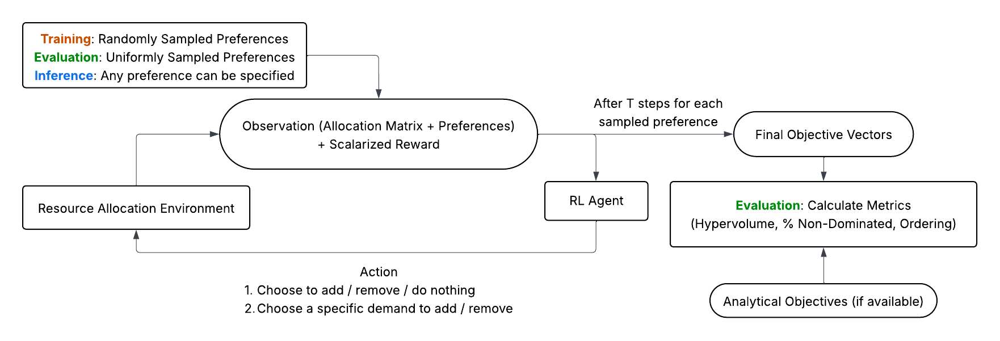

# GraphAllocBench

GraphAllocBench is a benchmark and toolkit for Preference-Conditioned Policy Learning (PCPL) for multiple objectives. It provides a flexible resource-allocation environment, a set of configurable problem definitions, and a suite of evaluation utilities so researchers and practitioners can design scenarios that stress different trade-offs and Pareto fronts.

At its core, GraphAllocBench makes it easy to:

- Create customizable problems by varying numbers of demands, resources, objectives, and objective shapes (e.g. sinusoidal, concave, convex, bell-shaped, S-shaped).
- Produce diverse Pareto fronts and objective landscapes to evaluate PCPL and scalarization strategies.
- Run batch preference sweeps and standardized evaluations (Pareto extraction, hypervolume, proportion of non-dominated solutions, ordering score, inference helpers).



We include an example PCPL setup using Stable Baselines3 PPO paired with a Smooth Tchebycheff scalarization to demonstrate how to train and evaluate agents with preference-conditioned rewards.

## Quick Start

This package requires **Python 3.10 or higher** and uses [uv](https://docs.astral.sh/uv/)
for package management.

### Installation (uv)

Install [uv](https://docs.astral.sh/uv/getting-started/installation/) if you don't
have it, then from the repository root:

```bash
uv sync          # creates a managed .venv, resolves dependencies, writes uv.lock
```

This installs `graphallocbench` (editable) together with all dependencies into a
project-local virtual environment. Run any command inside that environment with
`uv run`:

```bash
uv run python -c "import graphallocbench; print('ok')"
```

> Prefer a classic editable install instead? `uv pip install -e .` (after
> `uv venv`) also works, but `uv sync` is recommended for a reproducible lockfile.

### Pulling baseline submodules

The PD-MORL and Envelope Q-Learning baselines depend on external repositories
vendored under `pdmorl/external/` and `envelope/external/`. Fetch them with:

```bash
git submodule update --init --recursive          # PD-MORL
git clone https://github.com/RunzheYang/MORL envelope/external/MORL   # Envelope
```

(The Envelope repository is referenced in `.gitmodules` but is not committed as a
gitlink, so it is cloned directly into the expected path.) These are **not** needed
to run PCPL-PPO or the PSL baseline.

### Example Usage

```python
from graphallocbench import CityPlannerEnv
from graphallocbench.evaluation import run_experiments

env = CityPlannerEnv("graphallocbench/config/problems/problem_0.yml") # Enter the path to your problem configuration YAML file
obs, info = env.reset()
print(env.action_space, env.observation_space)
```

More examples can be found in `graphallocbench/examples/*`.

### Training & Evaluating

Train and evaluate the PCPL-PPO agent on a single problem (run via `uv run`):

```bash
uv run python train.py    --problems problem_0 --seeds 0 --workers 1 --wandb-mode disabled
uv run python evaluate.py --problems problem_0 --seeds 0
```

Omit `--problems` to run the full benchmark, add `--gnn` for the large 100×100
graph problems (6a–6c), and use `--seeds 0 1 2 3 4` for multi-seed runs.

### Baselines

Three algorithmic baselines are provided for comparison:

- **PD-MORL** (`pdmorl/`) — `uv run python pdmorl/train_graphalloc_pdmorl.py --config graphallocbench/config/problems/problem_0.yml`
- **Envelope Q-Learning** (`envelope/`) — `uv run python envelope/train_graphalloc_envelope.py --config graphallocbench/config/problems/problem_0.yml`
- **PSL (Pareto Set Learning)** (`psl/`) — `uv run python psl/train_graphalloc_psl.py --config graphallocbench/config/problems/problem_0.yml`

See [psl/README.md](psl/README.md) for details on the PSL baseline.

## Components

The package exposes four main modules:

1. `graphallocbench.city_env` – Environment implementation (`CityPlannerEnv`) and neural architectures / feature extractors.
2. `graphallocbench.evaluation` – Utilities for evaluating trained PCPL agents (Pareto front extraction, hypervolume, ordering score, inference helpers, etc.).
3. `graphallocbench.train_utils` – Training helpers (single/parallel PPO training utilities).
4. `graphallocbench.constants` – Centralized global constants (e.g., RL model class, allowed devices, inference batch size).

## Environment implementation details

For full implementation details of the environment (observations, action space, requirements matrix, allocation matrix, productions, objective functions, and reward modes) see the companion document: [GraphAllocBench.md](GraphAllocBench.md).

## Config Files
Problem configuration YAMLs describe resource capacities, demands, objectives, and scalarization settings. You can create your own or adapt the examples shipped under `graphallocbench/configs/problems/*`.

### Using Stable-Baselines3 PPO
```python
from stable_baselines3 import PPO
model = PPO("MultiInputPolicy", env)
model.learn(total_timesteps=10_000)
```

### Batch Inference / Preference Sweep
```python
from graphallocbench.evaluation import run_experiments
final_objectives, allocations = run_experiments(env, model=model, n_iter=32)
print(final_objectives.shape)
```

## Citing
If you use GraphAllocBench, please cite the accompanying research paper. (BibTeX will be added when available.)

## License
MIT License (see `LICENSE`).

## Disclaimer
The original research code is preserved under `legacy/*`.